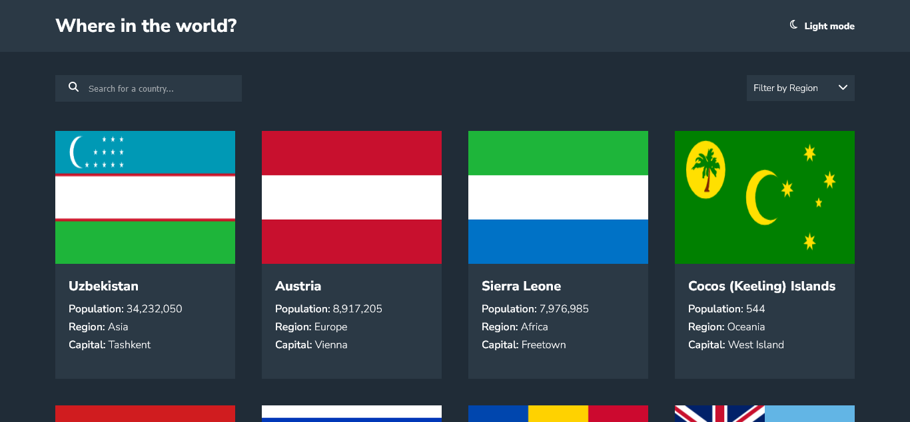

# Frontend Mentor - REST Countries API with color theme switcher solution

This is a solution to the [REST Countries API with color theme switcher challenge on Frontend Mentor](https://www.frontendmentor.io/challenges/rest-countries-api-with-color-theme-switcher-5cacc469fec04111f7b848ca).

## Table of contents

- [The challenge](#the-challenge)
- [Screenshot](#screenshot)
- [Links](#links)
- [Built with](#built-with)
- [Author](#author)

### The challenge

Users should be able to:

- See all countries from the API on the homepage
- Search for a country using an `input` field
- Filter countries by region
- Click on a country to see more detailed information on a separate page
- Click through to the border countries on the detail page
- Toggle the color scheme between light and dark mode *(optional)*

### Screenshot

### Links

- Solution URL: [Github](https://github.com/sangodare/Rest-countries-api.git)
- Live Site URL: [Live site](https://restcountriesapibytoyeeb.netlify.app)

### Built with

- Semantic HTML5 markup
- CSS custom properties
- Flexbox
- JavaScript

### Author

- Frontend Mentor - [@sangodare](https://www.frontendmentor.io/profile/sangodare)
